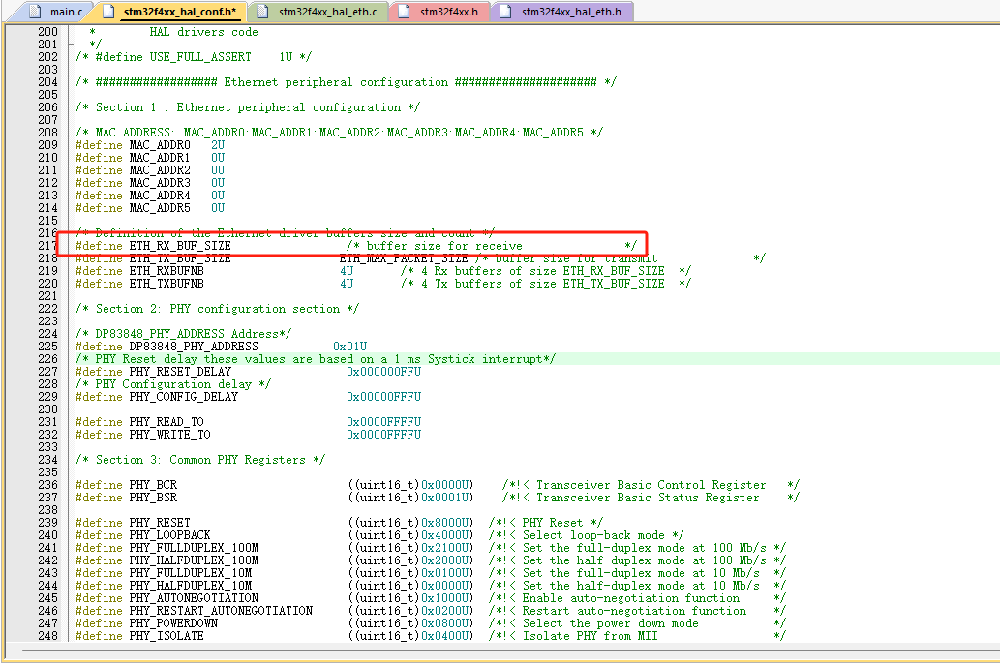
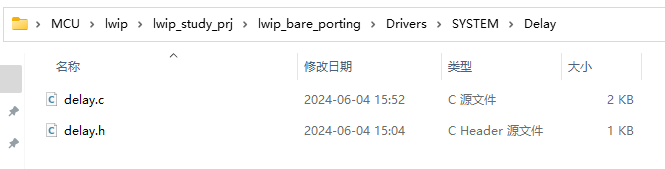
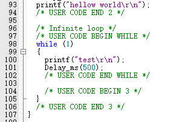
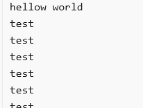

## 1 CubeMX创建空白工程

## 2 加入HAL库以太网驱动文件

- 1.27的HAL库版本中stm32f4xx_hal_conf.h存在一个bug，如下图所示，改为：

```c
#define ETH_RX_BUF_SIZE                ETH_MAX_PACKET_SIZE
```



- stm32f4xx_hal_conf.h中添加宏定义

```c
#define HAL_ETH_MODULE_ENABLED
```

## 3 重定向printf移植delay函数

- 重定义printf，勾选micro lib

```c
int fputc(int ch, FILE *f)
 
{
 
  HAL_UART_Transmit(&huart1, (uint8_t *)&ch, 1, 0xffff);
 
  return ch;
 
}
```



## 4 测试




